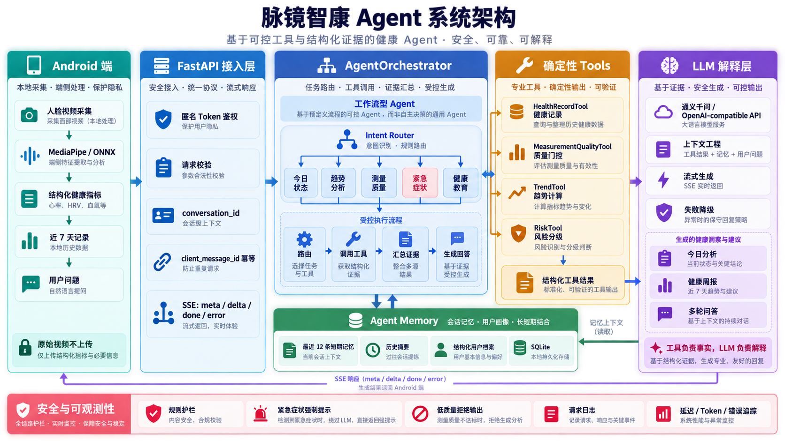
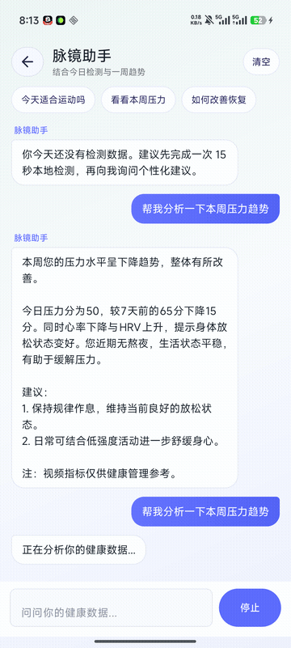

# 脉镜智康：端云协同个人健康管理 Agent

脉镜智康是一个端云协同的健康管理原型：Android 端通过 MediaPipe 与 ONNX Runtime 在本地处理人脸视频并生成结构化健康指标；FastAPI 后端通过确定性工具、规则护栏、分层记忆和大语言模型生成今日分析、健康周报及多轮问答。

> 本项目用于工程研究与个人健康趋势管理，不构成医学诊断，也不能替代专业医疗设备或医生建议。



### 真机 SSE 演示



## 核心能力

- **受控动态 Tool Calling**：LLM 使用 OpenAI-compatible Function Calling 选择工具，注册中心负责白名单、最大工具数、依赖排序和安全工具强制执行。
- **多步 Agent 执行**：按“健康记录 → 质量门控 → 可选趋势 → 风险分级 → LLM 解释”执行，并返回逐步 `tool_trace`。
- **来源约束 RAG**：`KnowledgeRetrievalTool` 从经过审核的 WHO、CDC 和 AHA 条目中检索健康知识，回答只能引用返回的标题与 URL。
- **事实与解释分离**：工具负责确定性计算，LLM 仅解释结构化结果并生成建议。
- **分层记忆**：最近 12 条消息作为短期上下文，历史消息压缩为摘要，用户偏好独立保存。
- **可靠流式交互**：使用 SSE `meta / delta / done / error` 协议，支持取消、重试和恢复。
- **请求幂等**：以 `client_message_id` 和数据库唯一索引防止网络重试造成重复消息。
- **安全护栏**：低质量测量拒绝解释，紧急症状走强制提示，模型不可用时返回规则结果。
- **隐私优先**：原始人脸视频默认只在手机端处理，服务端接收结构化指标。

## 技术栈

| 模块 | 技术 |
| --- | --- |
| Android | Java、Camera2、MediaPipe Face Landmarker、ONNX Runtime、OkHttp、SQLite |
| Agent 后端 | Python 3.11、FastAPI、Pydantic、httpx、aiosqlite |
| Agent 能力 | Intent Router、Tool Schema、Tool Registry、Function Calling、Multi-step Execution、Context Engineering、Conversation Memory、Guardrails |
| 模型接入 | OpenAI-compatible Chat Completions API、JSON 结构化输出、SSE Streaming |
| 工程化 | Docker Compose、pytest、Gradle |

## 仓库结构

```text
.
├── app/                 # Android 应用（保留标准 Gradle app 模块结构）
├── backend/             # FastAPI Agent 后端
│   ├── app/
│   │   ├── agents/      # 编排、Prompt 与上下文构建
│   │   ├── api/         # HTTP/SSE API
│   │   ├── schemas/     # Pydantic 数据契约
│   │   └── services/    # LLM、记忆、鉴权、规则与数据服务
│   └── tests/
├── docs/                # 架构、评测与工程文档
├── tools/               # ONNX 导出、验证及文档工具
├── docker-compose.yml
└── settings.gradle
```

## 快速启动后端

### Docker Compose（推荐）

```powershell
Copy-Item backend/.env.example backend/.env
docker compose up --build
```

启动后访问：

- 健康检查：<http://127.0.0.1:8100/health>
- OpenAPI 文档：<http://127.0.0.1:8100/docs>

`LLM_API_KEY` 为空时，后端仍可通过规则和本地模板返回结果。接入模型时，在 `backend/.env` 中填写兼容 OpenAI Chat Completions API 的地址、模型名称和密钥。

### 本地 Python

```powershell
cd backend
python -m venv .venv
.\.venv\Scripts\Activate.ps1
pip install -r requirements-dev.txt
Copy-Item .env.example .env
pytest
uvicorn app.main:app --host 0.0.0.0 --port 8100 --reload
```

## 运行 Android

1. 使用 Android Studio 打开仓库根目录。
2. 等待 Gradle 同步并连接 Android 10（API 29）或更高版本设备。
3. 启动本地后端，并执行：

```powershell
adb reverse tcp:8100 tcp:8100
```

4. 运行 Debug 构建。Debug 版本通过 `http://127.0.0.1:8100` 访问已反向映射的后端。

Release 构建中的服务地址目前仅用于开发演示，发布前必须替换为 HTTPS 域名并启用严格鉴权。

## 测试

后端：

```powershell
cd backend
pytest
```

确定性 Agent 评测：

```powershell
cd backend
python -m evals.run
```

当前评测集包含 46 个样本，覆盖意图路由、质量门控、风险规则、趋势计算和完整工作流准备，结果为 **46/46（100%）**；后端自动化测试为 **21 项通过**。这些数字只表示当前版本在仓库内确定性测试集上的表现，不代表 LLM 回答质量或临床准确性。详细结果见 [Agent Eval 报告](backend/evals/reports/latest.md)。

## 受控 Tool Calling 设计

所有工具通过统一 `ToolSpec` 声明名称、用途、JSON Schema、执行阶段和是否为安全必选项。LLM 只能从 Tool Registry 暴露的白名单中选择工具，模型返回的未知工具会被拒绝。当前健康工具不接受模型生成的健康数值参数，而是读取服务端认证用户的数据，避免用户输入或模型修改事实。

```text
LLM Function Calling 选择下一工具
            ↓
Tool Registry 白名单与数量限制
            ↓
执行工具并生成 Observation
            ↓
持久化 SQLite Checkpoint
            ↓
未完成则 Re-plan（最多 3 轮）
            ↓
强制 RiskTool → LLM 基于证据生成回答
```

每一轮只接受尚未执行的白名单工具，执行结果作为 Observation 反馈给下一轮规划；循环最多执行 3 轮，避免重复调用和无限循环。每次 `plan / observe / complete` 状态保存至 SQLite Checkpoint。模型未配置、不支持工具调用或规划失败时自动切换到 `deterministic_fallback`；趋势类问题仍由本地策略保证执行 `TrendTool`。响应中的 `planning_mode`、`run_id` 和 `planning_iterations` 可用于审计执行路径。

配置阿里云百炼后，可以执行兼容性冒烟测试：

```powershell
cd backend
python tools/verify_qwen_tool_calling.py
```

Android：

```powershell
.\gradlew.bat testDebugUnitTest assembleDebug
```

## API

| 方法 | 路径 | 功能 |
| --- | --- | --- |
| `POST` | `/api/auth/anonymous` | 获取匿名设备令牌 |
| `POST` | `/api/health/records/sync` | 同步结构化健康记录 |
| `GET` | `/api/health/records` | 查询当前用户健康记录 |
| `GET/PUT` | `/api/health/profile` | 查询或更新用户档案 |
| `POST` | `/api/agent/analyze` | 生成今日状态分析 |
| `POST` | `/api/agent/weekly-report` | 生成健康周报 |
| `POST` | `/api/agent/chat` | JSON 或 SSE 多轮对话 |
| `DELETE` | `/api/agent/chat/{conversation_id}` | 清除会话记忆 |

## 当前边界与路线

当前版本是受控的工作流型 Agent，而不是无限自主执行的通用 Agent。接下来优先建设：

1. 扩展 Agent Eval：增加生成忠实性、Prompt Injection、延迟和成本评测。
2. 扩充可动态选择的业务工具，并验证多工具长轨迹恢复。
3. 将当前轻量词项检索升级为 Embedding + BM25 混合检索、重排序与 RAG 专项评测。
4. 持久化 Agent Trace、Prompt/模型版本记录和可观测性。
5. PostgreSQL、Redis、HTTPS、限流与生产级鉴权。

更多设计细节见 [Agent 对话优化说明](docs/AGENT_CHAT_OPTIMIZATION.md) 和 [项目工作总结](docs/FaceHealth_Agent_项目工作总结.md)。

## 第三方许可与隐私

仓库不包含真实 API Key、原始人脸视频或逐帧生理信号 CSV。EfficientPhys ONNX、
MediaPipe 与 ONNX Runtime 适用各自的第三方许可；复用或分发前请阅读
[THIRD_PARTY_NOTICES.md](THIRD_PARTY_NOTICES.md) 及 `licenses/` 中的完整许可证。
